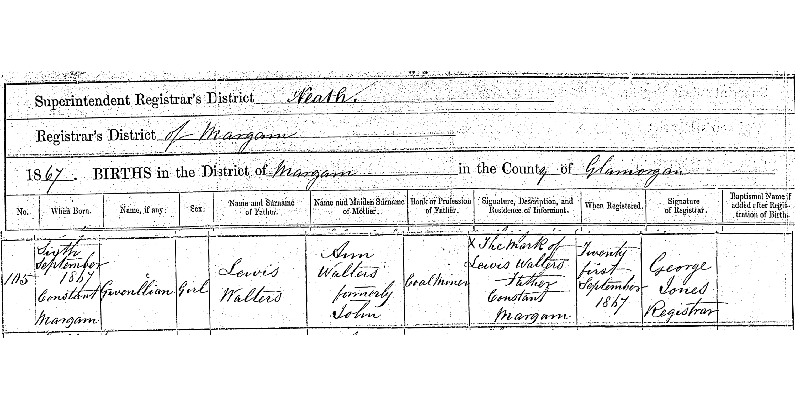
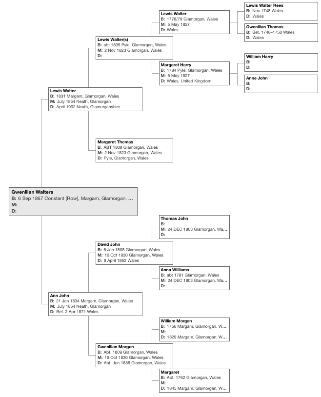

## Introduction

For years, I've devoted considerable time and resources to uncovering the fate of my great-grandmother Gwenllian Walters. Despite extensive research, her life after 1888 remains a mystery. This article compiles what we know about her life in Victorian Wales, in hopes that these details might resonate with someone researching their own family history.

## Who was Gwenllian Walters?

Born in 1867 in Margam, Glamorganshire, Gwenllian worked as a domestic servant in Llanelly, Carmarthenshire. After giving birth to a son in 1888, she placed him in the care of her sister Margaret and seemingly vanished from historical records.

## Early life

Gwenllian (from Welsh gwen "fair, blessed, white" and llian "flaxen") was born at home on Constant Row, Margam, on September 6, 1867. She was the fourth child and second daughter of Lewis Walter(s), a coal miner, and his wife Ann (née John).
<figure>
    
    <figcaption>The civil birth registration details for Gwenllian Walters. Image credit: Private collection.</figcaption>
</figure>
Tragedy struck early in Gwenllian's life. Her mother Ann died before April 1871, when we find three-year-old Gwenllian living at 3 Greenfield Row, Margam, with her:

- Paternal grandparents, Lewis and Margaret Walters
- Father, Lewis Walter(s)
- Siblings: David, Margaret, and William
- Maternal grandmother, Gwenllian John (née Morgan)

The presence of her maternal grandmother, also named Gwenllian, suggests she may have helped care for the motherless children. Like her sister, Gwenllian likely spoke both Welsh and English.

<figure>
    
    <figcaption>The pedigree chart for Gwenllian Walters.</figcaption>
</figure>

## The mystery deepens
By 1888, Gwenllian had moved to Llanelli, working as a domestic servant on Market Street. Her workplace at Mount Pleasant was roughly 500 meters from her residence.

### A mother's choice

On July 22, 1888, Gwenllian gave birth to a son, David Lewis Walters, at the Llanelly Union Workhouse. No father was listed on the birth certificate, though genetic genealogy research suggests the surname Thomas. The middle name "Lewis" could reference either Gwenllian's father or potentially indicate the father's first name.
After registering her son's birth, Gwenllian disappears from historical records. She likely remained at the workhouse briefly before seeking new employment. Her son, raised by her sister Margaret Ann Samuel, became known locally as "Dai Sam."

## Possible later sighting

A tantalising clue appears in the 1891 census: a "G. Walters" working as a housemaid at the Thomas Arms Hotel, Mount Pleasant, Llanelli (a pub that still operates today). While this person listed their birthplace as Aberavon (10km from Margam), such discrepancies were common in Victorian record-keeping.

## Do you have information about Gwenllian?
I'm particularly interested in:

1. Any records of a Gwenllian Walters (or similar variations) after 1888
2. Information about domestic servants at the Thomas Arms Hotel in the 1890s
3. Family stories about a Welsh woman named Gwenllian who appeared in your community in the late 1880s
4. Records from other workhouses or institutions that might mention her
5. Any Thomas family connections to the Llanelli area in the 1880s

## How to contact me
If any of these details spark a connection with your own family research, or if you have information about domestic servants in late Victorian Llanelli who could be Gwenllian, please message me on [Threads](https://www.threads.net/@gdewalters) or [Bluesky](https://bsky.app/profile/gdewalters.bsky.social).

*Every piece of information, no matter how small, could help solve the mystery of what happened to Gwenllian Walters.*

---

#WelshGenealogy #VictorianWales #FamilyHistory #Llanelli #MissingAncestors #DomesticServants